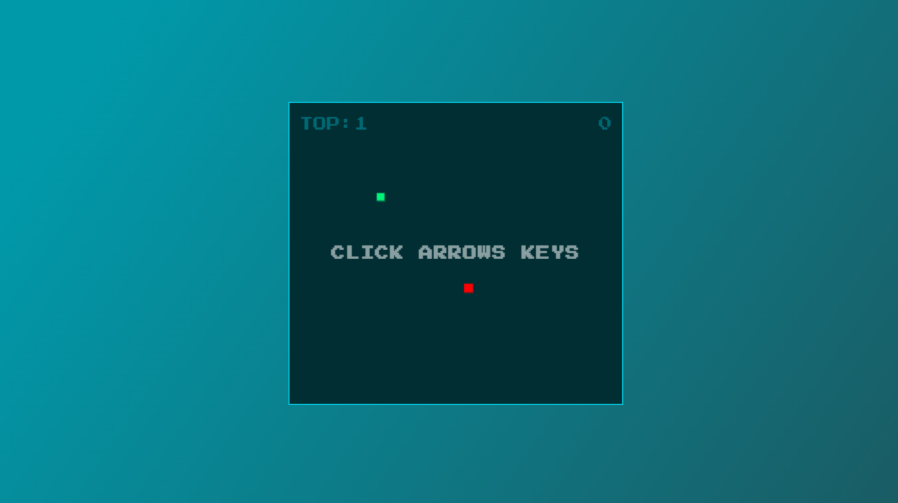
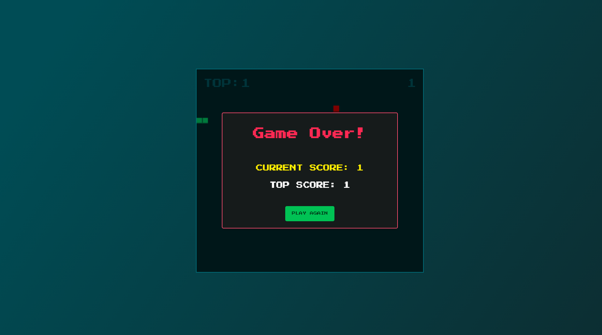
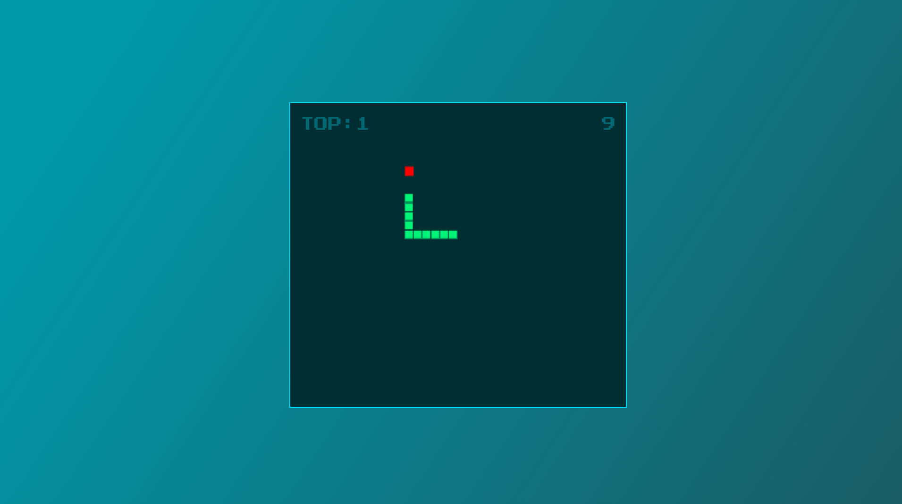

<h1>Snake Game</h1>

Fiz esse projeto para praticar Javascript. Utilizei o [Canvas do HTML](https://developer.mozilla.org/pt-BR/docs/Web/API/Canvas_API/Tutorial),
foi bem legal de criar, nunca tinha usado o canvas nem mesmo codado um jogo simples.

<h2></h2>

<h2>Imagens: </h2>



<h2></h2>



<h2></h2>



<h2>Funcionalidades: </h2>

- Tela de GameOver.
- Sistema de recorde e pontuação.
- Recorde salvo no LocalStorage.
- Movimentação tratada, baseado na direção.
- GameOver se encostar no próprio corpo ou no fim do canvas.

<h2>Rodando o projeto: </h2>

OBS: Para rodar esse projeto basta ter o [Git](https://git-scm.com) instalado em sua máquina.

```bash

1. Clone o repositório:
$ git clone https://github.com/gabriellima2/snake-game.git

2. Acesse a pasta e clique no index.html

```